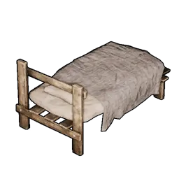
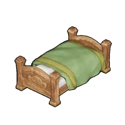
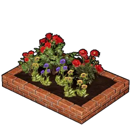

# Infrastructure

Base infrastructure and utility structures — human beds and base buffs.

## Beds (Human)

Where the player sleeps to pass the night and recover.

|  | Item | Source |
|:--:|------|------|
| { .item-icon } | [Shoddy Bed](shoddy-bed.md) | craft (Tech Lv 3) |
| { .item-icon } | [Fine Bed](fine-bed.md) | craft (Tech Lv 28) |

## Base Buffs

|  | Item | Source |
|:--:|------|------|
| { .item-icon } | [Flower Bed](flower-bed.md) | craft (Tech Lv 24) — +20% gathering |
