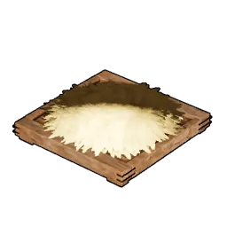
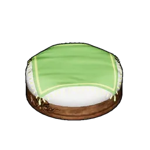
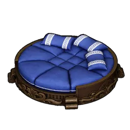
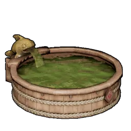
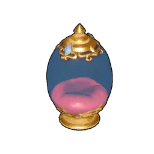

# Pal

Pal-related structures, grouped by function.

## Pal Training

|  | Item | Source |
|:--:|------|------|
| { .item-icon } | [Ranch](ranch.md) | craft (Tech Lv 5) |

## Pal Rest & Recovery

Pal beds — where Pals sleep, heal HP, and recover [Sanity](../../mechanics/sanity.md).

|  | Item | Source |
|:--:|------|------|
| { .item-icon } | [Straw Pal Bed](straw-pal-bed.md) | craft (Tech Lv 3) |
| { .item-icon } | [Fluffy Pal Bed](fluffy-pal-bed.md) | craft (Tech Lv 24) |
| { .item-icon } | [Large Pal Bed](large-pal-bed.md) | craft (Tech Lv 36) |
| { .item-icon } | [Ancient Pal Bed](ancient-pal-bed.md) | craft (Tech Lv 73) |

## Pal Management

|  | Item | Source |
|:--:|------|------|
| { .item-icon } | [Feed Box](feed-box.md) | craft (Tech Lv 4) |
| { .item-icon } | [Hot Spring](hot-spring.md) | craft (Tech Lv 9) — SAN recovery |
| { .item-icon } | [High Quality Hot Spring](high-quality-hot-spring.md) | stub |
| { .item-icon } | [Statue of Power](statue-of-power.md) | stub — Pal Soul enhance |

## Egg Hatching

|  | Item | Source |
|:--:|------|------|
| { .item-icon } | [Egg Incubator](egg-incubator.md) | craft (Tech Lv 10) |
