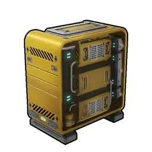
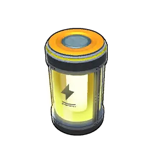

# Advanced Workshop

> The end-game item assembly line — advanced machinery pushes crafting to
> high speed. Heavy power draw.

The strongest general [[handiwork|Handiwork]] station, above the
[[production-assembly-line-ii|Production Assembly Line II]]. It draws 1000
electricity/sec for top-tier throughput. Drains sanity (SAN −0.2); defense 5.

## Notable crafts

Makes [[gunpowder|Gunpowder]] and the highest-tier items and gear at full speed.

## Build

Unlocked at **Technology Lv 62**. Build workload: 500000 ([[handiwork|Handiwork]]).
Requires an electricity supply to operate.

|  | Material | Qty |
|:--:|----------|:---:|
| { .game-icon } | [Coralum Ingot](../../items/materials/coralum-ingot.md) | 50 |
| { .game-icon } | [Hexolite](../../items/materials/hexolite.md) | 50 |
| { .game-icon } | [Computer](../../items/materials/computer.md) | 30 |
| { .game-icon } | [Bio Battery](../../items/materials/bio-battery.md) | 20 |
