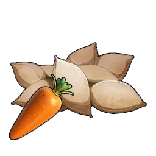

# Carrot Plantation

> A farm where you can grow [[carrot|Carrot]]. It takes time to harvest but
> widens the variety of meals you can prepare.

A base farm plot that produces [[carrot|Carrot]] over time. It needs a rotation
of Pals to run: [[planting|Planting]] to sow the seeds, [[watering|Watering]] to
grow them, and [[gathering|Gathering]] to harvest the crop. Defense 2.

## Produces

- [[carrot|Carrot]] — grown from [[carrot-seeds|Carrot Seeds]].

## Build

Unlocked at **Technology Lv 32**. Build workload: 20000 ([[handiwork|Handiwork]]).

|  | Material | Qty |
|:--:|----------|:---:|
| { .game-icon } | [Carrot Seeds](../../items/materials/carrot-seeds.md) | 3 |
| { .game-icon } | [Wood](../../items/materials/wood.md) | 30 |
| { .game-icon } | [Stone](../../items/materials/stone.md) | 20 |
| { .game-icon } | [Aquatic Pal Fluids](../../items/materials/aquatic-pal-fluids.md) | 1 |
