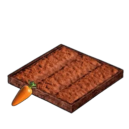

# Production

Production stations, grouped by function.

## Spheres

|  | Item | Source |
|:--:|------|------|
| { .item-icon } | [Sphere Workbench](sphere-workbench.md) | craft (Tech Lv 14) |
| { .item-icon } | [Sphere Assembly Line](sphere-assembly-line.md) | craft (Tech Lv 27) |
| { .item-icon } | [Sphere Assembly Line II](sphere-assembly-line-ii.md) | craft (Tech Lv 35) |
| { .item-icon } | [Advanced Sphere Assembly Line](advanced-sphere-assembly-line.md) | craft (Tech Lv 58) |

## Refinement

|  | Item | Source |
|:--:|------|------|
| { .item-icon } | [Primitive Furnace](primitive-furnace.md) | craft (Tech Lv 10) |
| { .item-icon } | [Improved Furnace](improved-furnace.md) | craft (Tech Lv 34) |
| { .item-icon } | [Electric Furnace](electric-furnace.md) | craft (Tech Lv 44) |
| { .item-icon } | [Gigantic Furnace](gigantic-furnace.md) | craft (Tech Lv 58) |
| { .item-icon } | [Ancient Furnace](ancient-furnace.md) | craft (Tech Lv 66) |

## Crafting / Repair

|  | Item | Source |
|:--:|------|------|
| { .item-icon } | [Primitive Workbench](primitive-workbench.md) | craft (Tech Lv 1) |
| { .item-icon } | [High Quality Workbench](high-quality-workbench.md) | craft (Tech Lv 11) |
| { .item-icon } | [Production Assembly Line](production-assembly-line.md) | craft (Tech Lv 29) |
| { .item-icon } | [Production Assembly Line II](production-assembly-line-ii.md) | craft (Tech Lv 42) |
| { .item-icon } | [Advanced Workshop](advanced-workshop.md) | craft (Tech Lv 62) |
| { .item-icon } | [Ancient Workbench](ancient-workbench.md) | craft (Tech Lv 67) |

## Medicine Production

|  | Item | Source |
|:--:|------|------|
| { .item-icon } | [Medieval Medicine Workbench](medieval-medicine-workbench.md) | craft |
| { .item-icon } | [Electric Medicine Workbench](electric-medicine-workbench.md) | craft |
| { .item-icon } | [Advanced Medicine Workbench](advanced-medicine-workbench.md) | craft |

## Lumbering / Mining

*None yet — to be added.*

## Weapons

|  | Item | Source |
|:--:|------|------|
| { .item-icon } | [Weapon Workbench](weapon-workbench.md) | craft |
| { .item-icon } | [Weapon Assembly Line](weapon-assembly-line.md) | craft |
| { .item-icon } | [Weapon Assembly Line II](weapon-assembly-line-ii.md) | craft |
| { .item-icon } | [Advanced Weapon Assembly Line](advanced-weapon-assembly-line.md) | craft |

## Milling / Crushing

|  | Item | Source |
|:--:|------|------|
| { .item-icon } | [Mill](mill.md) | craft (Tech Lv 15) |
| { .item-icon } | [Crusher](crusher.md) | craft (Tech Lv 8) |
| { .item-icon } | [Refrigerated Crusher](refrigerated-crusher.md) | stub |

## Farming

|  | Item | Source |
|:--:|------|------|
| { .item-icon } | [Carrot Plantation](carrot-plantation.md) | craft (Tech Lv 32) |

## Fishing Holes

*None yet — to be added.*
