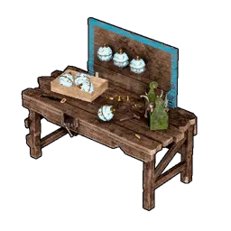
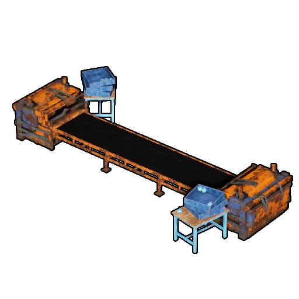
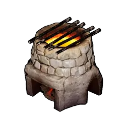
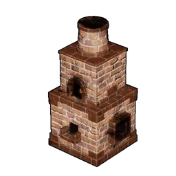
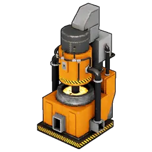
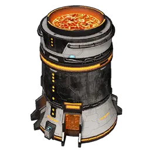
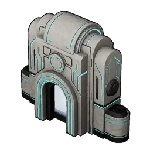
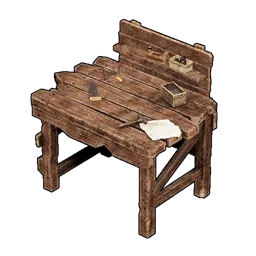
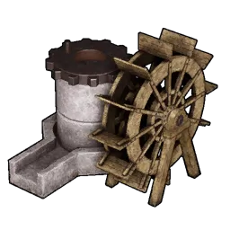

# Sản xuất

Các trạm sản xuất, chia theo chức năng.

## Sphere

|  | Vật phẩm | Nguồn |
|:--:|------|------|
| { .item-icon } | [Bàn chế tạo Sphere](sphere-workbench.md) | chế (Công nghệ Cấp 14) |
| { .item-icon } | [Dây chuyền Sphere](sphere-assembly-line.md) | chế (Công nghệ Cấp 27) |
| { .item-icon } | [Dây chuyền Sphere II](sphere-assembly-line-ii.md) | chế (Công nghệ Cấp 35) |
| { .item-icon } | [Dây chuyền Sphere nâng cao](advanced-sphere-assembly-line.md) | chế (Công nghệ Cấp 58) |

## Tinh luyện

|  | Vật phẩm | Nguồn |
|:--:|------|------|
| { .item-icon } | [Lò nung sơ khai](primitive-furnace.md) | chế (Công nghệ Cấp 10) |
| { .item-icon } | [Lò nung cải tiến](improved-furnace.md) | chế (Công nghệ Cấp 34) |
| { .item-icon } | [Lò nung điện](electric-furnace.md) | chế (Công nghệ Cấp 44) |
| { .item-icon } | [Lò nung khổng lồ](gigantic-furnace.md) | chế (Công nghệ Cấp 58) |
| { .item-icon } | [Lò nung cổ đại](ancient-furnace.md) | chế (Công nghệ Cấp 66) |

## Chế tạo / Sửa chữa

|  | Vật phẩm | Nguồn |
|:--:|------|------|
| { .item-icon } | [Bàn chế tạo sơ khai](primitive-workbench.md) | chế (Công nghệ Cấp 1) |
| { .item-icon } | [Bàn chế tạo cao cấp](high-quality-workbench.md) | chế (Công nghệ Cấp 11) |
| { .item-icon } | [Dây chuyền sản xuất](production-assembly-line.md) | chế (Công nghệ Cấp 29) |
| { .item-icon } | [Dây chuyền sản xuất II](production-assembly-line-ii.md) | chế (Công nghệ Cấp 42) |
| { .item-icon } | [Xưởng nâng cao](advanced-workshop.md) | chế (Công nghệ Cấp 62) |
| { .item-icon } | [Bàn chế tạo cổ đại](ancient-workbench.md) | chế (Công nghệ Cấp 67) |

## Medicine Production

|  | Vật phẩm | Nguồn |
|:--:|------|------|
| { .item-icon } | [Bàn chế thuốc trung cổ](medieval-medicine-workbench.md) | chế |
| { .item-icon } | [Bàn chế thuốc điện](electric-medicine-workbench.md) | chế |
| { .item-icon } | [Bàn chế thuốc nâng cao](advanced-medicine-workbench.md) | chế |

## Lumbering / Mining

*Chưa có mục nào — sẽ bổ sung.*

## Vũ khí

|  | Vật phẩm | Nguồn |
|:--:|------|------|
| { .item-icon } | [Bàn chế tạo vũ khí](weapon-workbench.md) | chế |
| { .item-icon } | [Dây chuyền vũ khí](weapon-assembly-line.md) | chế |
| { .item-icon } | [Dây chuyền vũ khí II](weapon-assembly-line-ii.md) | chế |
| { .item-icon } | [Dây chuyền vũ khí nâng cao](advanced-weapon-assembly-line.md) | chế |

## Xay / Nghiền

|  | Vật phẩm | Nguồn |
|:--:|------|------|
| { .item-icon } | [Cối xay](mill.md) | chế (Tech Lv 15) |
| { .item-icon } | [Máy nghiền](crusher.md) | chế (Tech Lv 8) |

## Hố câu cá

*Chưa có mục nào — sẽ bổ sung.*
