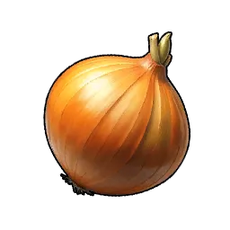
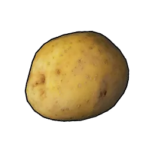
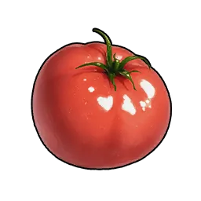

# Food

|  | Item | Source |
|:--:|------|------|
| { .item-icon } | [Chikipi Poultry](chikipi-poultry.md) | [Chikipi](../../pals/chikipi.md) drop |
| { .item-icon } | [Egg](egg.md) | [Chikipi](../../pals/chikipi.md) drop / ranch |
| { .item-icon } | [Lamball Mutton](lamball-mutton.md) | [Lamball](../../pals/lamball.md) drop |
| { .item-icon } | [Red Berries](red-berries.md) | [Cattiva](../../pals/cattiva.md) drop |
| { .item-icon } | [Flour](flour.md) | mill (Wheat) |
| { .item-icon } | [Bread](bread.md) | cook (Flour) |
| { .item-icon } | [Wheat](wheat.md) | grow (Wheat Seeds) |
| { .item-icon } | [Carrot](carrot.md) | [Ribbuny Botan](../../pals/ribbuny-botan.md) drop / grow |
| { .item-icon } | [Honey](honey.md) | [Elizabee](../../pals/elizabee.md) drop / Ranch |
| { .item-icon } | [Onion](onion.md) | grow (Onion Seeds) |
| { .item-icon } | [Potato](potato.md) | grow (Potato Seeds) |
| { .item-icon } | [Reindrix Venison](reindrix-venison.md) | [Reindrix](../../pals/reindrix.md) drop |
| { .item-icon } | [Tomato](tomato.md) | grow (Tomato Seeds) |
