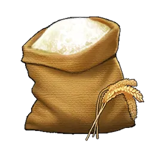
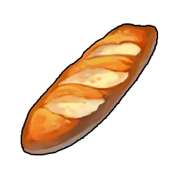
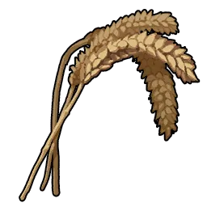
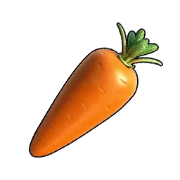

# Thức ăn

|  | Vật phẩm | Nguồn |
|:--:|------|------|
| { .item-icon } | [Thịt gà Chikipi](chikipi-poultry.md) | [Chikipi](../../pals/chikipi.md) rơi |
| { .item-icon } | [Trứng](egg.md) | [Chikipi](../../pals/chikipi.md) rơi / trang trại |
| { .item-icon } | [Thịt cừu Lamball](lamball-mutton.md) | [Lamball](../../pals/lamball.md) rơi |
| { .item-icon } | [Red Berries](red-berries.md) | [Cattiva](../../pals/cattiva.md) rơi |
| { .item-icon } | [Bột Mì](flour.md) | xay (Lúa Mì) |
| { .item-icon } | [Bánh Mì](bread.md) | nấu (Bột Mì) |
| { .item-icon } | [Lúa Mì](wheat.md) | trồng (Hạt Lúa Mì) |
| { .item-icon } | [Carrot](carrot.md) | [Ribbuny Botan](../../pals/ribbuny-botan.md) rơi / trồng |
