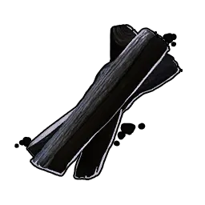
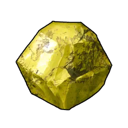
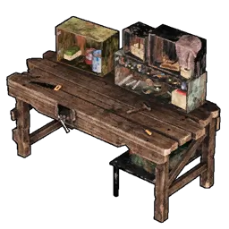
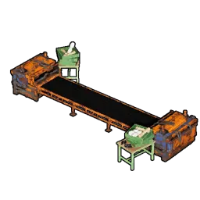

# Gunpowder

> Gunpowder used to fire ammunition. Required to make bullets.

## Craft

Unlocked at **Technology Lv 21**.

|  | Material | Qty |
|:--:|----------|:---:|
| { .game-icon } | [Charcoal](charcoal.md) | 2 |
| { .game-icon } | [Sulfur](sulfur.md) | 1 |

**Craftable at**

|  | Station |
|:----:|---------|
| { .game-icon } | [High Quality Workbench](high-quality-workbench.md) |
| { .game-icon } | [Production Assembly Line](production-assembly-line.md) |
| { .game-icon } | [Production Assembly Line II](production-assembly-line-ii.md) |
| { .game-icon } | [Advanced Workshop](advanced-workshop.md) |
| { .game-icon } | [Ancient Workbench](ancient-workbench.md) |

## Use

Make bullets and other ammunition.

## Stats

| Rarity | Weight | Max stack | Sell |
|:------:|:------:|:---------:|:----:|
| Common (rank 2) | 0.2 | 9999 | 430 Gold |
