# Items

|  | Item | Category | Source |
|:--:|------|----------|--------|
| 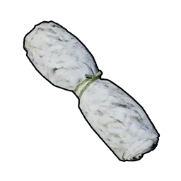{ .item-icon } | [Wool](wool.md) | material | [Lamball](../pals/lamball.md) drop / ranch |
| 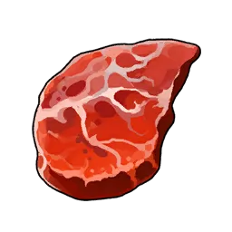{ .item-icon } | [Lamball Mutton](lamball-mutton.md) | food | [Lamball](../pals/lamball.md) drop |
| 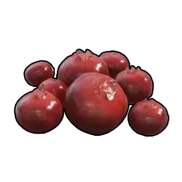{ .item-icon } | [Red Berries](red-berries.md) | food | [Cattiva](../pals/cattiva.md) drop |
| 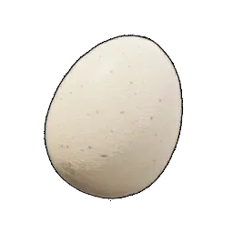{ .item-icon } | [Egg](egg.md) | food | [Chikipi](../pals/chikipi.md) drop / ranch |
| 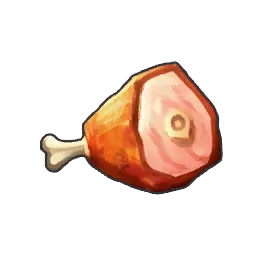{ .item-icon } | [Chikipi Poultry](chikipi-poultry.md) | food | [Chikipi](../pals/chikipi.md) drop |
| 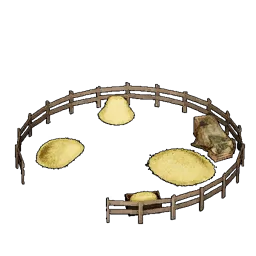{ .item-icon } | [Ranch](ranch.md) | structure | craft (Tech Lv 5) |
| 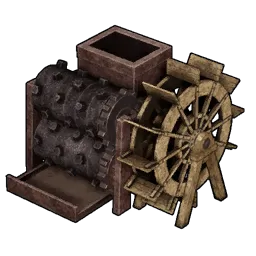{ .item-icon } | [Crusher](crusher.md) | structure | craft (Tech Lv 8) |
| { .item-icon } | [Wood](wood.md) | material | gather |
| { .item-icon } | [Stone](stone.md) | material | gather |
| { .item-icon } | [Fiber](fiber.md) | material | gather (trees) |
| 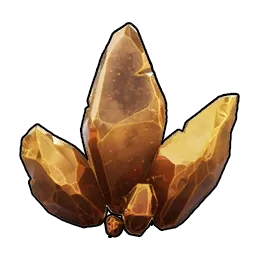{ .item-icon } | [Ore](ore.md) | material | mine |
| 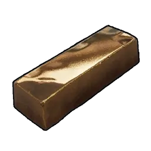{ .item-icon } | [Ingot](ingot.md) | material | refine from Ore |
| 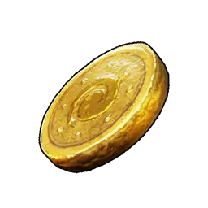{ .item-icon } | [Gold Coin](gold-coin.md) | material | craft from Ingot / sell |
| { .item-icon } | [Paldium Fragment](paldium-fragment.md) | material | craft from Stone / gather |
| 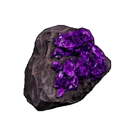{ .item-icon } | [Meteorite Fragment](meteorite-fragment.md) | material | gather → Crusher → Paldium |
| { .item-icon } | [Pal Sphere](pal-sphere.md) | sphere | craft (CP 7) |
| 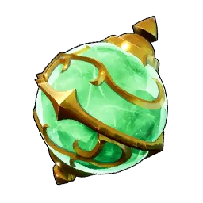{ .item-icon } | [Mega Sphere](mega-sphere.md) | sphere | craft (CP 14) |
| 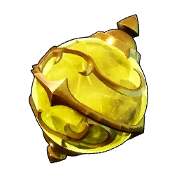{ .item-icon } | [Giga Sphere](giga-sphere.md) | sphere | craft (CP 20) |
| 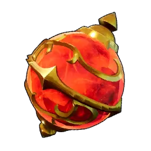{ .item-icon } | [Hyper Sphere](hyper-sphere.md) | sphere | craft (CP 27) |
| 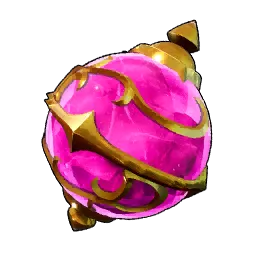{ .item-icon } | [Ultra Sphere](ultra-sphere.md) | sphere | craft (CP 33) |
| 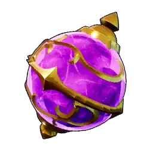{ .item-icon } | [Legendary Sphere](legendary-sphere.md) | sphere | craft (CP 38) |
| { .item-icon } | [Refined Ingot](refined-ingot.md) | material | refine Ore + Coal |
| 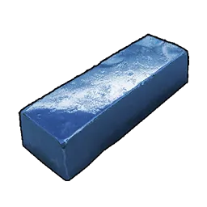{ .item-icon } | [Pal Metal Ingot](pal-metal-ingot.md) | material | refine Ore + Quartz + Paldium |
| 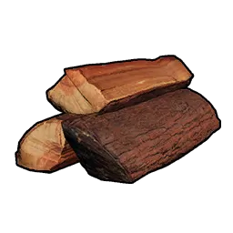{ .item-icon } | [Hardwood](hardwood.md) | material | gather (harsh biomes) |
| 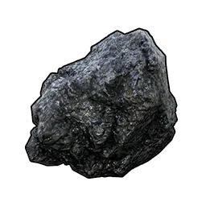{ .item-icon } | [Coal](coal.md) | material | stub |
| 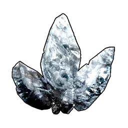{ .item-icon } | [Pure Quartz](pure-quartz.md) | material | stub |
