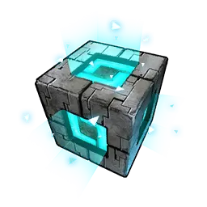
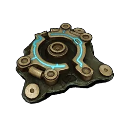
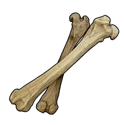
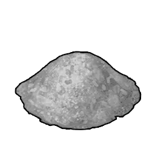
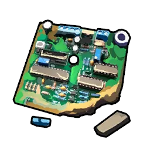
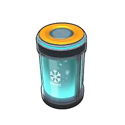
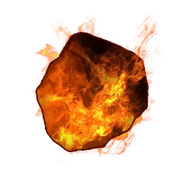
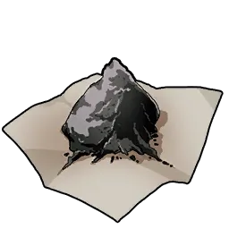
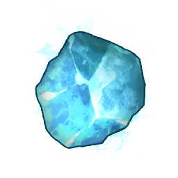
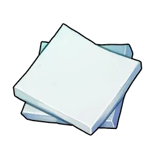

# Nguyên liệu

|  | Vật phẩm | Nguồn |
|:--:|------|------|
| { .item-icon } | [Lõi AI](ai-core.md) | stub |
| { .item-icon } | [Ancient Civilization Core](ancient-civilization-core.md) | hiếm (tàn tích) |
| { .item-icon } | [Ancient Civilization Parts](ancient-civilization-parts.md) | boss / tàn tích |
| { .item-icon } | [Aquatic Pal Fluids](aquatic-pal-fluids.md) | Pal Nước rơi |
| { .item-icon } | [Pin Sinh Học](bio-battery.md) | chế (Dây chuyền sản xuất II) |
| { .item-icon } | [Bone](bone.md) | Pal rơi |
| { .item-icon } | [Carbon Fiber](carbon-fiber.md) | stub |
| { .item-icon } | [Xi Măng](cement.md) | chế (HQ Workbench) |
| { .item-icon } | [Than Củi](charcoal.md) | chế (Gỗ) |
| { .item-icon } | [Bảng Mạch](circuit-board.md) | chế (Quartz + Polymer) |
| { .item-icon } | [Than](coal.md) | đào (hang) / Blazamut·Pierdon |
| { .item-icon } | [Máy Tính](computer.md) | stub |
| { .item-icon } | [Coralum Ingot](coralum-ingot.md) | stub |
| { .item-icon } | [Dung Môi Ăn Mòn](corrosive-solvent.md) | stub |
| { .item-icon } | [Dung Dịch Làm Lạnh](cryogenic-coolant.md) | chế (Assembly Line) |
| { .item-icon } | [Electric Organ](electric-organ.md) | Pal Điện rơi |
| { .item-icon } | [Sợi thực vật](fiber.md) | thu từ cây |
| { .item-icon } | [Flame Organ](flame-organ.md) | Pal Lửa rơi |
| { .item-icon } | [Đồng Vàng](gold-coin.md) | chế từ Thỏi Đồng / bán |
| { .item-icon } | [Thuốc Súng](gunpowder.md) | chế (Than Củi + Lưu Huỳnh) |
| { .item-icon } | [Gỗ Cứng](hardwood.md) | nhặt (biome khắc nghiệt) |
| { .item-icon } | [Hexolite](hexolite.md) | stub |
| { .item-icon } | [Dầu Pal Cao Cấp](high-quality-pal-oil.md) | Pal rơi |
| { .item-icon } | [Ice Organ](ice-organ.md) | Pal Băng rơi |
| { .item-icon } | [Thỏi Đồng](ingot.md) | nung từ Quặng Đồng |
| { .item-icon } | [Mảnh Thiên Thạch](meteorite-fragment.md) | nhặt → Crusher → Paldium |
| { .item-icon } | [Đinh](nail.md) | chế (Thỏi Đồng) |
| { .item-icon } | [Quặng Đồng](ore.md) | đào |
| { .item-icon } | [Thỏi Pal Metal](pal-metal-ingot.md) | luyện Quặng + Thạch Anh + Paldium |
| { .item-icon } | [Mảnh Paldium](paldium-fragment.md) | chế từ Đá / nhặt |
| { .item-icon } | [Plasteel](plasteel.md) | stub |
| { .item-icon } | [Polymer](polymer.md) | chế (Dầu Pal + Lưu Huỳnh) |
| { .item-icon } | [Thạch Anh Tinh Khiết](pure-quartz.md) | đào (tuyết) / Pierdon Cryst |
| { .item-icon } | [Thỏi Tinh Luyện](refined-ingot.md) | luyện Quặng + Than |
| { .item-icon } | [Soralite Ingot](soralite-ingot.md) | stub |
| { .item-icon } | [Đá](stone.md) | thu thập |
| { .item-icon } | [Lưu Huỳnh](sulfur.md) | đào (núi lửa) / Pierdon |
| { .item-icon } | [Thermal Core](thermal-core.md) | stub |
| { .item-icon } | [Hạt Lúa Mì](wheat-seeds.md) | Lifmunk rơi |
| { .item-icon } | [Gỗ](wood.md) | thu thập |
| { .item-icon } | [Ván Gỗ](wooden-board.md) | stub |
| { .item-icon } | [Len](wool.md) | [Lamball](../pals/lamball.md) rơi / trang trại |
