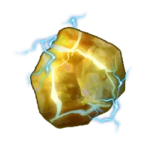
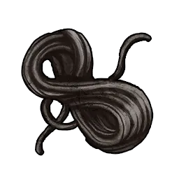
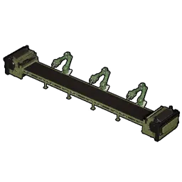
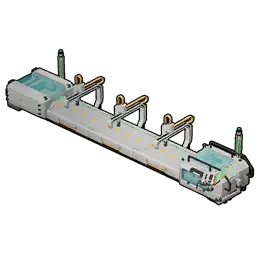

# Pin Sinh Học (Bio Battery)

> Thiết bị lưu năng lượng sinh học thành điện, dùng cho trang bị cần mật độ năng
> lượng cao. Chế tại Dây chuyền sản xuất II.

Linh kiện cấp điện giai đoạn cuối. Mở ở Công nghệ Cấp 44 và chế tại
[[production-assembly-line-ii|Dây chuyền sản xuất II]]; nó cấp điện cho các công
trình cuối game.

## Chế tạo

|  | Nguyên liệu | SL |
|:--:|-------------|:--:|
| { .game-icon } | [Electric Organ](electric-organ.md) | 1 |
| { .game-icon } | [Refined Ingot](refined-ingot.md) | 1 |
| { .game-icon } | [Sợi Carbon](carbon-fiber.md) | 1 |

**Chế được tại**

|  | Trạm |
|:----:|------|
| { .game-icon } | [Dây chuyền sản xuất II](../../construction/production/production-assembly-line-ii.md) |
| { .game-icon } | [Xưởng nâng cao](../../construction/production/advanced-workshop.md) |
| { .game-icon } | [Bàn chế tạo cổ đại](../../construction/production/ancient-workbench.md) |

## Dùng để xây

- [[advanced-workshop|Xưởng nâng cao]] (×20)
- [[ancient-workbench|Bàn chế tạo cổ đại]] (×20)
- [[advanced-sphere-assembly-line|Dây chuyền Sphere nâng cao]] (×10)
- [[electric-furnace|Lò nung điện]] (×4)

## Chỉ số

| Độ hiếm | Bậc | Khối lượng | Xếp chồng | Bán |
|:-------:|:---:|:----------:|:---------:|:---:|
| Common | 4 | 5 | 9999 | 2230 Vàng |
