# Nguyên liệu

|  | Vật phẩm | Nguồn |
|:--:|------|------|
| { .item-icon } | [Lõi AI](ai-core.md) | stub |
| { .item-icon } | [Lõi Văn minh Cổ đại](ancient-civilization-core.md) | hiếm (tàn tích) |
| { .item-icon } | [Linh kiện Văn minh Cổ đại](ancient-civilization-parts.md) | boss / tàn tích |
| { .item-icon } | [Dịch Pal Nước](aquatic-pal-fluids.md) | Pal Nước rơi |
| { .item-icon } | [Hoa đẹp](beautiful-flower.md) | hái / [Ribbuny](../../pals/ribbuny.md) rơi |
| { .item-icon } | [Hạt giống Berry](berry-seeds.md) | Pal rơi / thương nhân |
| { .item-icon } | [Pin Sinh Học](bio-battery.md) | chế (Dây chuyền sản xuất II) |
| { .item-icon } | [Xương](bone.md) | Pal rơi |
| { .item-icon } | [Sợi Carbon](carbon-fiber.md) | stub |
| { .item-icon } | [Hạt giống Cà Rốt](carrot-seeds.md) | [Ribbuny Botan](../../pals/ribbuny-botan.md) rơi |
| { .item-icon } | [Xi Măng](cement.md) | chế (HQ Workbench) |
| { .item-icon } | [Than Củi](charcoal.md) | chế (Gỗ) |
| { .item-icon } | [Bảng Mạch](circuit-board.md) | chế (Quartz + Polymer) |
| { .item-icon } | [Vải](cloth.md) | chế (Bàn chế tạo sơ khai) |
| { .item-icon } | [Than](coal.md) | đào (hang) / Blazamut·Pierdon |
| 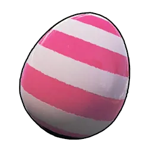{ .item-icon } | [Trứng Thường](common-egg.md) | tổ / nhân giống (Neutral) |
| { .item-icon } | [Máy Tính](computer.md) | stub |
| { .item-icon } | [Coralum Ingot](coralum-ingot.md) | stub |
| { .item-icon } | [Dung Môi Ăn Mòn](corrosive-solvent.md) | stub |
| { .item-icon } | [Dầu Thô](crude-oil.md) | Máy khai thác Dầu Thô / Pal rơi |
| { .item-icon } | [Dung Dịch Làm Lạnh](cryogenic-coolant.md) | chế (Assembly Line) |
| { .item-icon } | [Trứng Ẩm](damp-egg.md) | tổ / nhân giống (Water) |
| { .item-icon } | [Trứng Ẩm Lớn](large-damp-egg.md) | tổ / nhân giống (Water, Rare) |
| 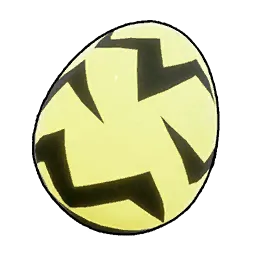{ .item-icon } | [Trứng Điện Lớn](large-electric-egg.md) | tổ / nhân giống (Electric, Rare) |
| { .item-icon } | [Trứng Bóng Tối Lớn](large-dark-egg.md) | tổ / nhân giống (Dark, Rare) |
| 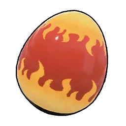{ .item-icon } | [Trứng Cháy Lớn](large-scorching-egg.md) | tổ / nhân giống (Fire, Rare) |
| { .item-icon } | [Trứng Thường Khổng Lồ](huge-common-egg.md) | tổ / nhân giống (Neutral, Legendary) |
| { .item-icon } | [Trứng Băng Khổng Lồ](huge-frozen-egg.md) | tổ / nhân giống (Ice, Legendary) |
| 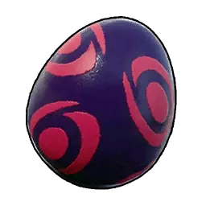{ .item-icon } | [Trứng Bóng Tối](dark-egg.md) | tổ / nhân giống (Dark) |
| { .item-icon } | [Cơ Quan Điện](electric-organ.md) | Pal Điện rơi |
| { .item-icon } | [Sợi thực vật](fiber.md) | thu từ cây |
| { .item-icon } | [Cơ Quan Lửa](flame-organ.md) | Pal Lửa rơi |
| { .item-icon } | [Trứng Băng](frozen-egg.md) | tổ / nhân giống (Ice) |
| { .item-icon } | [Giant Pal Soul](giant-pal-soul.md) | Crusher (Large ×2) / Pal rơi |
| { .item-icon } | [Đồng Vàng](gold-coin.md) | chế từ Thỏi Đồng / bán |
| { .item-icon } | [Lá Gumoss](gumoss-leaf.md) | [Gumoss](../../pals/gumoss.md) rơi |
| { .item-icon } | [Thuốc Súng](gunpowder.md) | chế (Than Củi + Lưu Huỳnh) |
| { .item-icon } | [Gỗ Cứng](hardwood.md) | nhặt (biome khắc nghiệt) |
| { .item-icon } | [Hexolite](hexolite.md) | stub |
| 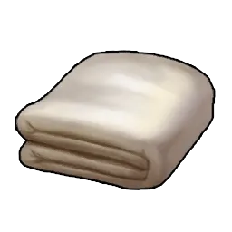{ .item-icon } | [Vải cao cấp](high-quality-cloth.md) | chế (Bàn chế tạo cao cấp) |
| { .item-icon } | [Dầu Pal Cao Cấp](high-quality-pal-oil.md) | Pal rơi |
| { .item-icon } | [Trứng Xanh Khổng Lồ](huge-verdant-egg.md) | tổ / nhân giống (Grass, lớn) |
| { .item-icon } | [Cơ Quan Băng](ice-organ.md) | Pal Băng rơi |
| 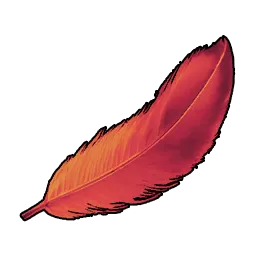{ .item-icon } | [Lông Vũ Penking](penking-plume.md) | [Penking](../../pals/penking.md) rơi |
| { .item-icon } | [Thỏi Đồng](ingot.md) | nung từ Quặng Đồng |
| { .item-icon } | [Trứng Băng Lớn](large-frozen-egg.md) | tổ / nhân giống (Ice, lớn) |
| { .item-icon } | [Large Pal Soul](large-pal-soul.md) | Crusher (Medium ×2) / Pal rơi |
| { .item-icon } | [Da](leather.md) | Pal rơi |
| 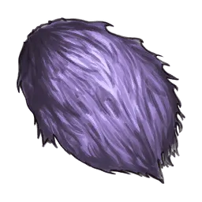{ .item-icon } | [Lông Katress](katress-hair.md) | [Katress](../../pals/katress.md) rơi |
| { .item-icon } | [Ngọc Rạng Neutral](neutral-radiant-gem.md) | [Kingpaca](../../pals/kingpaca.md) alpha rơi |
| { .item-icon } | [Ngọc Rạng Băng](ice-radiant-gem.md) | [Reindrix](../../pals/reindrix.md) alpha rơi |
| { .item-icon } | [Hạt giống Xà Lách](lettuce-seeds.md) | Trang trại (Vaelet) |
| { .item-icon } | [Medium Pal Soul](medium-pal-soul.md) | Crusher (Small ×2) / Pal rơi |
| { .item-icon } | [Mảnh Thiên Thạch](meteorite-fragment.md) | nhặt → Crusher → Paldium |
| { .item-icon } | [Mythical Wood](mythical-wood.md) | stub |
| { .item-icon } | [Đinh](nail.md) | chế (Thỏi Đồng) |
| { .item-icon } | [Hạt giống Hành Tây](onion-seeds.md) | Grass Pal drop / Trang trại |
| { .item-icon } | [Quặng Đồng](ore.md) | đào |
| { .item-icon } | [Thỏi Pal Metal](pal-metal-ingot.md) | luyện Quặng + Thạch Anh + Paldium |
| { .item-icon } | [Mảnh Paldium](paldium-fragment.md) | chế từ Đá / nhặt |
| { .item-icon } | [Plasteel](plasteel.md) | stub |
| { .item-icon } | [Polymer](polymer.md) | chế (Dầu Pal + Lưu Huỳnh) |
| 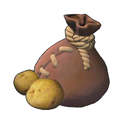{ .item-icon } | [Hạt giống Khoai Tây](potato-seeds.md) | Grass Pal drop / Trang trại |
| { .item-icon } | [Thạch Anh Tinh Khiết](pure-quartz.md) | đào (tuyết) / Pierdon Cryst |
| { .item-icon } | [Thỏi Tinh Luyện](refined-ingot.md) | luyện Quặng + Than |
| { .item-icon } | [Nơ Ribbuny](ribbuny-ribbon.md) | [Ribbuny](../../pals/ribbuny.md) rơi |
| 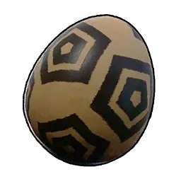{ .item-icon } | [Trứng Đá](rocky-egg.md) | tổ / nhân giống (Ground) |
| { .item-icon } | [Small Pal Soul](small-pal-soul.md) | Crusher / Pal rơi |
| { .item-icon } | [Soralite Ingot](soralite-ingot.md) | stub |
| { .item-icon } | [Đá](stone.md) | thu thập |
| { .item-icon } | [Lưu Huỳnh](sulfur.md) | đào (núi lửa) / Pierdon |
| 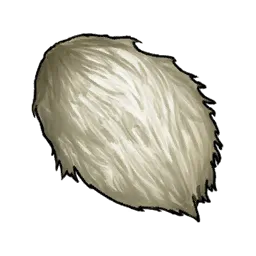{ .item-icon } | [Lông Swee](swee-hair.md) | [Swee](../../pals/swee.md) rơi |
| { .item-icon } | [Thermal Core](thermal-core.md) | stub |
| { .item-icon } | [Hạt giống Cà Chua](tomato-seeds.md) | thương nhân / Grass Pal rơi |
| { .item-icon } | [Tuyến Nọc Độc](venom-gland.md) | Pal độc rơi |
| 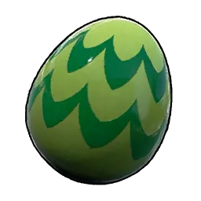{ .item-icon } | [Trứng Xanh](verdant-egg.md) | tổ / nhân giống (Grass) |
| { .item-icon } | [Hạt giống Lúa Mì](wheat-seeds.md) | Lifmunk rơi |
| { .item-icon } | [Gỗ](wood.md) | thu thập |
| { .item-icon } | [Ván Gỗ](wooden-board.md) | stub |
| { .item-icon } | [Len](wool.md) | [Lamball](../../pals/lamball.md) rơi / trang trại |
| { .item-icon } | [World Tree Holy Water](world-tree-holy-water.md) | stub |
| { .item-icon } | [Sừng](horn.md) | Pal rơi |
