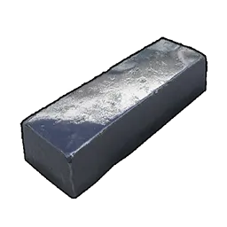
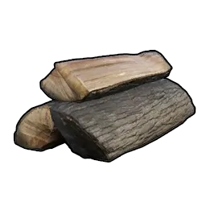
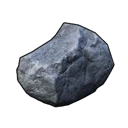
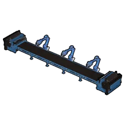
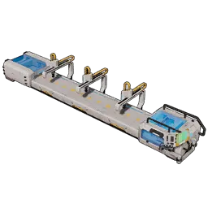
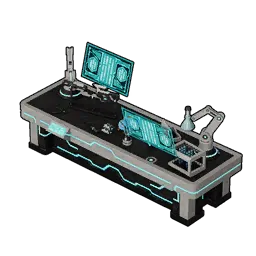

# Ultra Sphere

> Ném để bắt Pal. Thiết kế cực hiệu quả, hiếm Pal nào thoát được.

Capture Power **33** · mở khoá ở Technology Lv **35**.

## Chế tạo

|  | Nguyên liệu | SL |
|:--:|-------------|:--:|
| { .game-icon } | [Mảnh Paldium](../materials/paldium-fragment.md) | 5 |
| { .game-icon } | [Thỏi Tinh Luyện](../materials/refined-ingot.md) | 3 |
| { .game-icon } | [Gỗ](../materials/wood.md) | 10 |
| { .game-icon } | [Đá](../materials/stone.md) | 10 |

**Chế được tại**

|  | Trạm |
|:----:|------|
| { .game-icon } | [Dây chuyền Sphere II](../../construction/production/sphere-assembly-line-ii.md) |
| { .game-icon } | [Dây chuyền Sphere nâng cao](../../construction/production/advanced-sphere-assembly-line.md) |
| { .game-icon } | [Bàn chế tạo cổ đại](../../construction/production/ancient-workbench.md) |

## Chỉ số

| Độ hiếm | Khối lượng | Xếp chồng | Bán |
|:-------:|:----------:|:---------:|:---:|
| Rare | 0.1 | 9999 | 3300 Gold |
