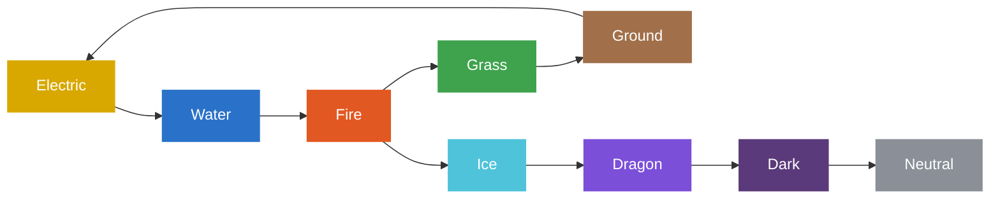

# Elements

Palworld has **9 elements**. Every Pal has one or two, and attacks carry an
element. An attack that is *super-effective* against the target's element deals
extra damage (and the reverse: the target is *weak to* that element).

## Interactive chart

Click an element (or hover) to see what it beats and what beats it — green =
super-effective against, red = weak to.

## How to read it

Two structures make up the chart (arrow = super-effective against):

- **5-element cycle** (rock-paper-scissors):
  Electric → Water → Fire → Grass → Ground → Electric.
- **Linear chain** off Fire:
  Fire → Ice → Dragon → Dark → Neutral.

So **Fire** is the only element that is super-effective against two others
(Grass and Ice), and **Neutral** is super-effective against nothing (it only
has a weakness — Dark).

!!! note "Source"
    Effectiveness taken from the in-game element chart (arrows = super-effective).
    "Weak to" is the strict inverse of those arrows. Damage multipliers are not
    recorded here — the chart shows relationships, not numbers.
