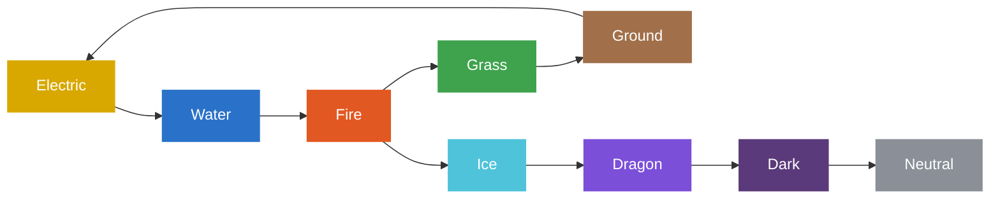

# Nguyên tố (Elements)

Palworld có **9 nguyên tố**. Mỗi Pal mang một hoặc hai nguyên tố, và đòn đánh
cũng có nguyên tố. Đòn *khắc* (super-effective) với nguyên tố của mục tiêu gây
thêm sát thương (và ngược lại: mục tiêu *yếu trước* nguyên tố đó).

## Bảng khắc hệ tương tác

Bấm (hoặc rê chuột) vào một nguyên tố để xem nó khắc gì và bị gì khắc — xanh =
khắc (mạnh hơn), đỏ = yếu trước.

## Cách đọc

Bảng gồm hai cấu trúc (mũi tên = khắc):

- **Vòng 5 nguyên tố** (kéo-búa-bao):
  Electric → Water → Fire → Grass → Ground → Electric.
- **Chuỗi thẳng** rẽ từ Fire:
  Fire → Ice → Dragon → Dark → Neutral.

Vậy **Fire** là nguyên tố duy nhất khắc được hai nguyên tố khác (Grass và Ice),
còn **Neutral** không khắc nguyên tố nào (chỉ có điểm yếu — Dark).

!!! note "Nguồn"
    Dữ liệu khắc hệ lấy từ bảng nguyên tố trong game (mũi tên = khắc). Chiều "yếu
    trước" suy ngược từ các mũi tên đó. Không ghi hệ số sát thương — bảng chỉ thể
    hiện quan hệ, không phải con số.
