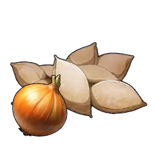

# Broncherry

> Stub — awaiting data.

## Drops

On capture or defeat:

|  | Item | Qty | Chance |
|:----:|------|:---:|:------:|
| { .game-icon } | [Onion Seeds](../items/materials/onion-seeds.md) | ×1–2 | 100% |
