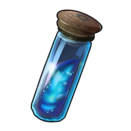

# Celaray Lux <small>#7B</small>

> Its flashy patterns help it attract a partner. But after a long history of
> electrocution incidents involving Celaray Lux, yellow-and-black stripes are now
> seen across the island as a sign of danger.

A [[elements|Water]]/[[elements|Electric]] dual-element variant of
[[celaray|Celaray]] — Paldeck #7B, size M, rarity 4. A **unique breeding** result,
not caught in the wild.

## Food

Consumption **2 / 10**.

## Partner skill

**Jolt Glider** — while Celaray Lux is in your party it modifies the equipped
glider: it **prevents all fall damage** and extends the duration of high-speed
gliding. The Awakening bonus raises glider performance from Lv 2:

| Lv | Fall damage | Awakening |
|:--:|-------------|-----------|
| 1 | Fully prevented | — |
| 2 | Fully prevented | Glider Performance Boost: S |
| 3 | Fully prevented | Glider Performance Boost: M |
| 4 | Fully prevented | Glider Performance Boost: L |
| 5 | Fully prevented | Glider Performance Boost: XL |

Glider tuning by skill level (a stronger glider than base [[celaray|Celaray]]):

| Lv | Max Speed | Gravity Scale | Glide SP drain |
|:--:|:---------:|:-------------:|:--------------:|
| 1 | 700 | ? | 9.5 |
| 2 | 850 | 0.013 | 8 |
| 3 | ? | 0.011 | 7 |
| 4 | 1150 | 0.009 | ? |
| 5 | 1300 | 0.007 | 3.5 |

## Work & base use

|  | Work | Lv |
|:----:|------|:--:|
| { .game-icon } | [Watering](../mechanics/work/watering.md) | 1 |
| { .game-icon } | [Generating Electricity](../mechanics/work/generating-electricity.md) | 2 |
| { .game-icon } | [Transporting](../mechanics/work/transporting.md) | 1 |

Its Electric side adds [[generating-electricity|Generating Electricity]] Lv 2 —
useful at a power generator — on top of the glider buff it shares with base
[[celaray|Celaray]].

## Combat

[[elements|Water]]/[[elements|Electric]] dual type — weak to Electric (Water) and
Ground (Electric). Decent melee (MeleeAttack 100) with modest Attack (75),
Health 80, Defense 80.

## Breeding

CombiRank 2380. Hatches from a **Damp Egg**. Produced by the unique combo
[[celaray|Celaray]] + [[univolt|Univolt]]. See [[breeding]].

## Drops

On capture or defeat:

|  | Item | Qty | Chance |
|:----:|------|:---:|:------:|
| { .game-icon } | [Aquatic Pal Fluids](../items/materials/aquatic-pal-fluids.md) | ×1–2 | 100% |

## Where to find

Not found in the wild — obtained only via breeding ([[celaray|Celaray]] +
[[univolt|Univolt]]).
