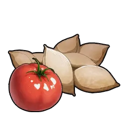

# Cinnamoth

> Stub — awaiting data.

## Drops

On capture or defeat:

|  | Item | Qty | Chance |
|:----:|------|:---:|:------:|
| { .game-icon } | [Tomato Seeds](../items/materials/tomato-seeds.md) | ×1 | 75% |
| { .game-icon } | [Honey](../items/food/honey.md) | ×1 | 100% |
