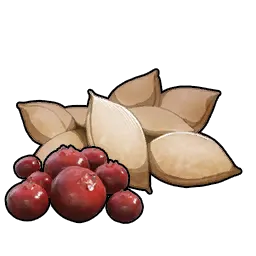

# Clovee <small>#14</small>

> Xưa kia có những con mọc ba lá trở lên trên trán. Được xem là biểu tượng may mắn nên
> những con nhiều lá bị săn lùng dữ dội, khiến cả loài dần tiến hoá để mọc ít lá
> hơn theo thời gian.

Một Pal hệ [[elements|Grass]]/[[elements|Neutral]] thời kỳ đầu — Paldeck #14, cỡ
XS, độ hiếm 2. Một Pal hỗ trợ căn cứ, buff Gathering cho các thợ khác.

## Thức ăn

Mức ăn **1 / 10** — rất thấp, nuôi cực rẻ.

## Partner skill

**Happy Clover** — khi được giao ở căn cứ, nó tăng cấp
[[gathering|Gathering]] của **tất cả Pal khác trong căn cứ thêm +1** (không cộng
dồn). Mức thưởng là **+1** cố định — không tăng theo cấp kỹ năng. Lựa chọn tốt để
cắm ở căn cứ chuyên thu thập.

## Công việc & vai trò ở căn cứ

|  | Công việc | Cấp độ |
|:----:|------|:--:|
| { .game-icon } | [Planting](../mechanics/work/planting.md) | 1 |
| { .game-icon } | [Gathering](../mechanics/work/gathering.md) | 1 |

Cả hai đều cấp 1, nhưng giá trị thật sự là buff **+1 Gathering** cho cả căn cứ từ
Happy Clover.

## Chiến đấu

Hệ đôi [[elements|Grass]]/[[elements|Neutral]] — yếu trước Fire (do Grass) và Dark
(do Neutral). Cận chiến khá (MeleeAttack 100) nhưng Attack/Defense thấp (65). Ở
cấp 80 đạt Health 4100–5060, Attack 490–607, Defense 440–557.

## Nhân giống

CombiRank 2970. Nở từ **Verdant Egg**. Chưa ghi nhận cặp bố mẹ nào. Xem [[breeding]].

## Vật phẩm rơi

Khi bắt hoặc hạ gục:

|  | Vật phẩm | SL | Tỉ lệ |
|:----:|------|:---:|:------:|
| { .game-icon } | [Berry Seeds](../items/materials/berry-seeds.md) | ×1–2 | 100% |

## Nơi tìm thấy

Chưa ghi nhận vị trí xuất hiện.
