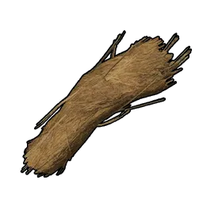
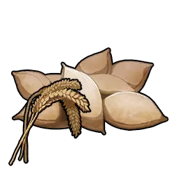

# Hangyu <small>#38</small>

> Đôi tay khổng lồ của nó xé toạc được cả sắt thép. Tương truyền tội phạm nặng
> từng bị treo giữa quảng trường cho Hangyu lột da khỏi xương.

Một Pal hệ [[elements|Ground]] — Paldeck #38, cỡ XS, độ hiếm 1. Biến thể hệ Ice
của nó là [[hangyu-cryst|Hangyu Cryst]] (#38B). Giá trị thật nằm
ở partner skill: nâng cấp glider và cho phép bay lên cao giữa lúc lượn.

## Thức ăn

Mức ăn **1 / 10** — rất thấp, nuôi cực rẻ.

## Partner skill

**Flying Trapeze** — khi Hangyu ở trong đội, nó thay đổi thông số glider đang
trang bị và cho phép **bay lên chậm trong lúc lượn**. Cấp càng cao thì hệ số
trọng lực của glider càng giảm (rơi chậm hơn / bay lên) và tiêu hao stamina tốt
hơn:

| Cấp độ | Tốc độ tối đa glider | Hệ số trọng lực | Glider SP |
|:--:|:----------------:|:-------------:|:---------:|
| 1 | 100 | 0.01 | — |
| 2 | — | 0.009 | 9 |
| 3 | — | 0.008 | 8 |
| 4 | — | 0.007 | 7 |
| 5 | — | 0.006 | 6 |

## Công việc & vai trò ở căn cứ

|  | Công việc | Cấp độ |
|:----:|------|:--:|
| { .game-icon } | [Handiwork](../mechanics/work/handiwork.md) | 1 |
| { .game-icon } | [Gathering](../mechanics/work/gathering.md) | 1 |
| { .game-icon } | [Transporting](../mechanics/work/transporting.md) | 2 |

Thợ căn cứ hạng khá đầu game — mạnh nhất ở Transporting (Cấp 2).

## Chiến đấu

Hệ [[elements|Ground]] — yếu trước Water, mạnh trước Electric. Chỉ số đồng đều
(Melee/Attack/Defense 70). Ở cấp 80 đạt Health 4100–5060, Attack 520–646, Defense
470–596.

## Nhân giống

CombiRank 2780. Nở từ **Trứng Đá**. Chưa ghi nhận cặp bố mẹ nào.

Con lai đã biết:

- [[hangyu|Hangyu]] + [[swee|Swee]] → [[hangyu-cryst|Hangyu Cryst]]

Xem [[breeding]].

## Vật phẩm rơi

Khi bắt hoặc hạ gục:

|  | Vật phẩm | SL | Tỉ lệ |
|:----:|------|:---:|:------:|
| { .game-icon } | [Fiber](../items/materials/fiber.md) | ×5–10 | 100% |
| { .game-icon } | [Hạt giống Lúa Mì](../items/materials/wheat-seeds.md) | ×1 | 100% |

## Nơi tìm thấy

Chưa ghi nhận vị trí xuất hiện.
