# Pals

|  | Pal | Hệ | Cỡ |
|:--:|-----|-----|:--:|
| 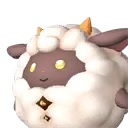{ .pal-avatar } | [Lamball](lamball.md) | Neutral | XS |
| { .pal-avatar } | [Cattiva](cattiva.md) | Neutral | XS |
| { .pal-avatar } | [Chikipi](chikipi.md) | Neutral | XS |
| { .pal-avatar } | [Lifmunk](lifmunk.md) | Grass | XS |
| { .pal-avatar } | [Fuack](fuack.md) | Water | XS |
| 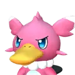{ .pal-avatar } | [Fuack Ignis](fuack-ignis.md) | Water Fire | XS |
| 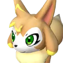{ .pal-avatar } | [Vixy](vixy.md) | Neutral | XS |
| { .pal-avatar } | [Celaray](celaray.md) | Water | M |
| { .pal-avatar } | [Celaray Lux](celaray-lux.md) | Water Electric | M |
| 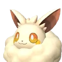{ .pal-avatar } | [Cremis](cremis.md) | Neutral | XS |
| { .pal-avatar } | [Croajiro](croajiro.md) | Water | XS |
| { .pal-avatar } | [Croajiro Noct](croajiro-noct.md) | Water Dark | XS |
| { .pal-avatar } | [Herbil](herbil.md) | Grass Neutral | XS |
| { .pal-avatar } | [Teafant](teafant.md) | Water | M |
| { .pal-avatar } | [Gumoss](gumoss.md) | Grass Ground | XS |
| 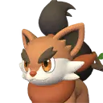{ .pal-avatar } | [Pupperai](pupperai.md) | Ground | XS |
| { .pal-avatar } | [Clovee](clovee.md) | Grass Neutral | XS |
| { .pal-avatar } | [Jolthog](jolthog.md) | Electric | XS |
| { .pal-avatar } | [Jolthog Cryst](jolthog-cryst.md) | Ice | XS |
| { .pal-avatar } | [Depresso](depresso.md) | Dark | XS |
| { .pal-avatar } | [Pengullet](pengullet.md) | Water Ice | XS |
| { .pal-avatar } | [Pengullet Lux](pengullet-lux.md) | Water Electric | XS |
| { .pal-avatar } | [Ribbuny](ribbuny.md) | Neutral | XS |
| { .pal-avatar } | [Ribbuny Botan](ribbuny-botan.md) | Grass | XS |
| 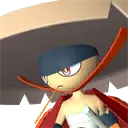{ .pal-avatar } | [Bushi](bushi.md) | Fire | M |
| 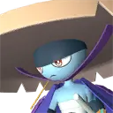{ .pal-avatar } | [Bushi Noct](bushi-noct.md) | Fire Dark | M |
| 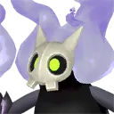{ .pal-avatar } | [Sootseer](sootseer.md) | Dark Fire | M |
| { .pal-avatar } | [Xenolord](xenolord.md) | — | — |
| { .pal-avatar } | [Xenovader](xenovader.md) | — | — |
| 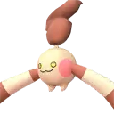{ .pal-avatar } | [Hangyu](hangyu.md) | Ground | XS |
| { .pal-avatar } | [Hangyu Cryst](hangyu-cryst.md) | Ice | XS |
| { .pal-avatar } | [Souffline](souffline.md) | — | — |
| { .pal-avatar } | [Shadowbeak](shadowbeak.md) | Dark | — |
| { .pal-avatar } | [Flopie](flopie.md) | — | — |
| 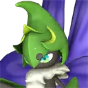{ .pal-avatar } | [Vaelet](vaelet.md) | Grass | M |
| { .pal-avatar } | [Prunelia](prunelia.md) | — | — |
| { .pal-avatar } | [Rampaging Flopie](rampaging-flopie.md) | — | — |
| { .pal-avatar } | [Xenogard](xenogard.md) | — | — |
| { .pal-avatar } | [Pierdon Cryst](pierdon-cryst.md) | — | — |
| { .pal-avatar } | [Pierdon](pierdon.md) | — | — |
| { .pal-avatar } | [Blazamut](blazamut.md) | — | — |
| { .pal-avatar } | [Blazamut Ryu](blazamut-ryu.md) | — | — |
| { .pal-avatar } | [Flambelle](flambelle.md) | — | — |
| { .pal-avatar } | [Univolt](univolt.md) | — | — |
| { .pal-avatar } | [Dinossom Lux](dinossom-lux.md) | — | — |
| { .pal-avatar } | [Mossanda](mossanda.md) | — | — |
| { .pal-avatar } | [Wumpo Botan](wumpo-botan.md) | — | — |
| { .pal-avatar } | [Palumba](palumba.md) | — | — |
| { .pal-avatar } | [Cinnamoth](cinnamoth.md) | — | — |
| { .pal-avatar } | [Dinossom](dinossom.md) | — | — |
| { .pal-avatar } | [Bristla](bristla.md) | — | — |
| { .pal-avatar } | [Braloha](braloha.md) | — | — |
| { .pal-avatar } | [Lovander](lovander.md) | — | — |
| 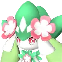{ .pal-avatar } | [Petallia](petallia.md) | Grass | M |
| 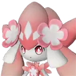{ .pal-avatar } | [Petallia Ignis](petallia-ignis.md) | Grass Fire | M |
| { .pal-avatar } | [Broncherry](broncherry.md) | — | — |
| { .pal-avatar } | [Broncherry Aqua](broncherry-aqua.md) | — | — |
| { .pal-avatar } | [Robinquill](robinquill.md) | — | — |
| { .pal-avatar } | [Robinquill Terra](robinquill-terra.md) | — | — |
| 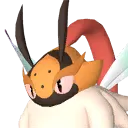{ .pal-avatar } | [Elizabee](elizabee.md) | Grass | L |
| 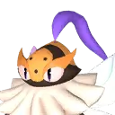{ .pal-avatar } | [Beegarde](beegarde.md) | Grass | M |
| { .pal-avatar } | [Swee](swee.md) | — | — |
| { .pal-avatar } | [Warsect](warsect.md) | — | — |
| { .pal-avatar } | [Warsect Terra](warsect-terra.md) | — | — |

