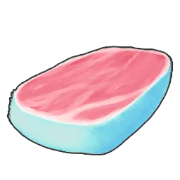

# Reindrix <small>#101</small>

> Its transparent cerulean antlers glow with the cold of absolute zero. Any who
> touch them with their bare hands are instantly frozen and smashed to pieces.

An [[elements|Ice]] Pal — Paldeck #101, size M, rarity 4. A tanky rideable mount
that grants Heat Resistance and doubles as a Lumbering/Cooling base worker.

## Food

Consumption **4 / 10** — moderate appetite.

## Partner skill

**Cool Body** — a rideable mount. While Reindrix is in your party, the player gains
**Heat Resistance +2** (survive hotter biomes). From Lv 2 an Awakening also grants
a **ride-speed bonus**. Does not stack:

| Lv | Heat Resistance | Ride Speed (Awakening) |
|:--:|:---------------:|:----------------------:|
| 1 | +2 | — |
| 2 | +2 | +10% |
| 3 | +2 | +12% |
| 4 | +2 | +15% |
| 5 | +2 | +20% |

## Work & base use

|  | Work | Lv |
|:----:|------|:--:|
| { .game-icon } | [Lumbering](../mechanics/work/lumbering.md) | 3 |
| { .game-icon } | [Cooling](../mechanics/work/cooling.md) | 3 |

Lumbering 3 and Cooling 3 make it a useful dual-purpose base worker.

## Combat

[[elements|Ice]] type — weak to Fire. Very tanky (Defense 110, Health 100) with
modest offense. At level 80 it reaches Health 4900–6100, Attack 610–763, Defense
710–908.

## Breeding

CombiRank 1930. Hatches from a **[[frozen-egg|Frozen Egg]]**. Documented parent
combos: none recorded yet.

Known children:

- [[kingpaca|Kingpaca]] + [[reindrix|Reindrix]] → [[kingpaca-cryst|Kingpaca Cryst]]

See [[breeding]].

## Drops

On capture or defeat:

|  | Item | Qty | Chance |
|:----:|------|:---:|:------:|
| { .game-icon } | [Reindrix Venison](../items/food/reindrix-venison.md) | ×2 | 100% |
| { .game-icon } | [Leather](../items/materials/leather.md) | ×1 | 100% |
| { .game-icon } | [Horn](../items/materials/horn.md) | ×2 | 100% |
| { .game-icon } | [Ice Organ](../items/materials/ice-organ.md) | ×2–3 | 100% |

As a **level-80 alpha**, it can additionally drop:

|  | Item | Qty | Chance |
|:----:|------|:---:|:------:|
| { .game-icon } | [Ice Radiant Gem](../items/materials/ice-radiant-gem.md) | ×10–20 | 100% |
| { .game-icon } | [Decayed Ancient Relic](../items/materials/decayed-ancient-relic.md) | ×30–50 | 100% |
| { .game-icon } | [Dormant Ancient Relic](../items/materials/dormant-ancient-relic.md) | ×10–20 | 100% |
| { .game-icon } | [Gorgeous Ancient Relic](../items/materials/gorgeous-ancient-relic.md) | ×4–8 | 100% |
| { .game-icon } | [Glowing Ancient Relic](../items/materials/glowing-ancient-relic.md) | ×2–3 | 50% |
| { .game-icon } | [Glistening Ancient Relic](../items/materials/glistening-ancient-relic.md) | ×1 | 25% |

## Where to find

Spawn location not recorded yet.
